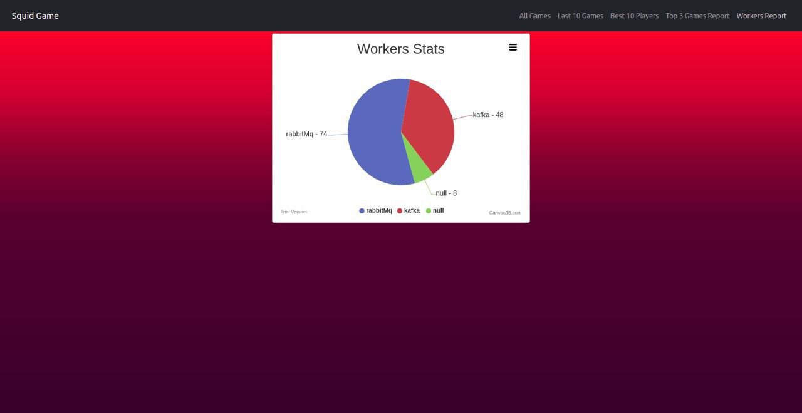
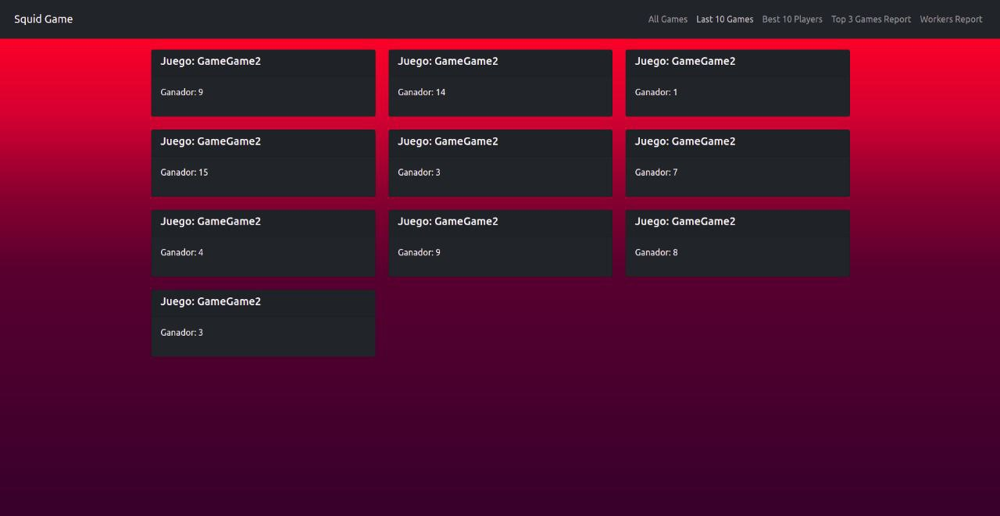
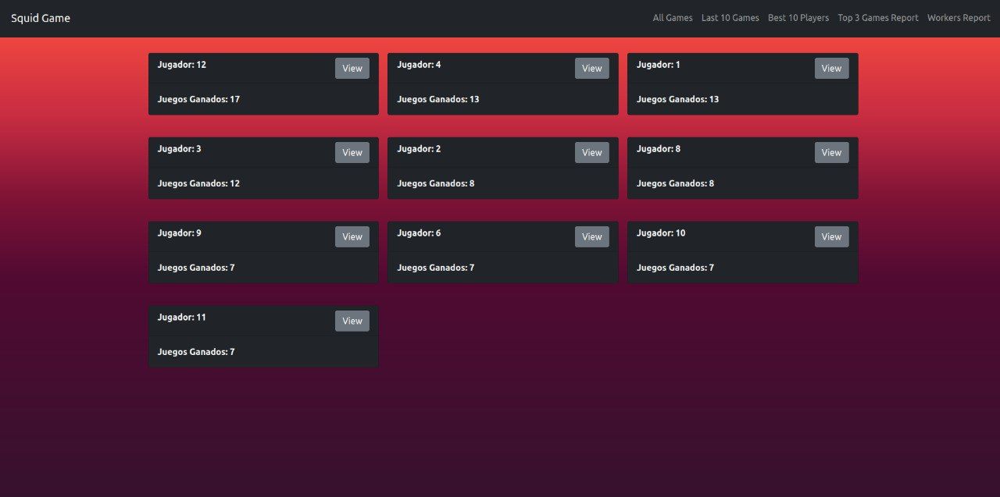
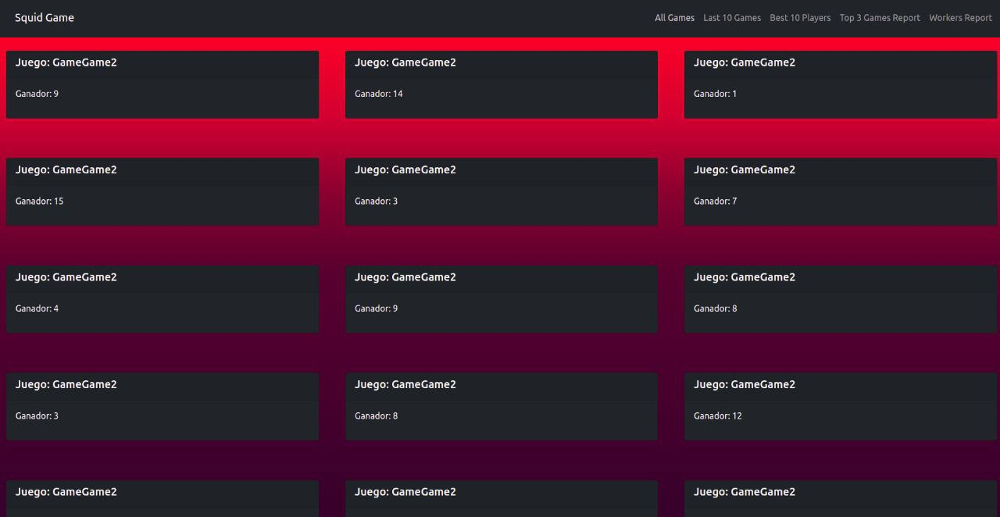
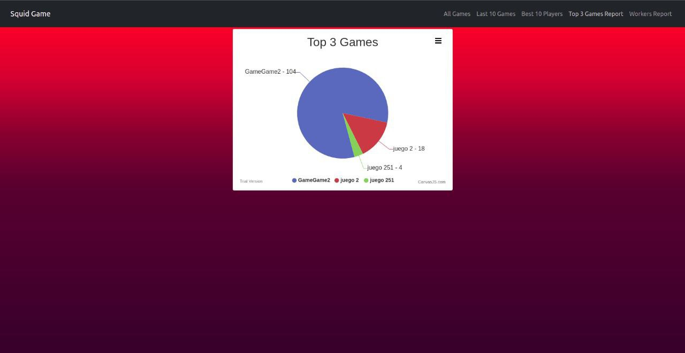

# Manual de Usuario

La aplicación de SquidGames es un sistema de juegos y mensajería inspirado en la famosa y aclamada serie coreana "El juego del Calamar", al contrario de la serie, todas las elecciones vitales son realizadas en el cluster de workers, no aquí

En esta aplicación se puede visualizar las estadisticas de los diferentes juegos, listos para apostar?

## Visualización de Estadisticas de los Workers

Esta página muestra que worker envía más información en general

## Visualización de los juegos
En esta sección se pueden visualizar los últimos 10 juegos jugados

En esta sección se visualizan el top 10 de los ganadores con más juegos ganados! Se encontrará allí el número 456?

En esta sección se puede visualizar los ganadores de los diferentes juegos, así como el nombre del juego. Esta es la sección donde se ven absolutamente todos los juegos

Mientras que en esta sección se pueden ver los 3 juegos más jugados

