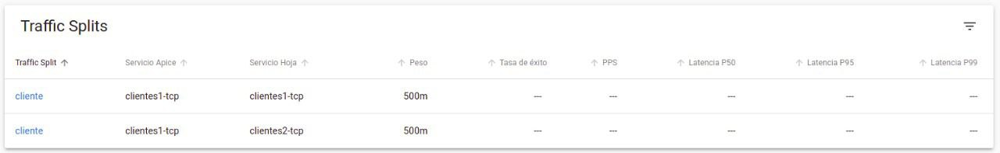

# Manual Técnico SquidGame

## Bases de Datos
En este proyecto, se implementaron las bases de datos en máquinas virtuales en Google Cloud

### [Redis](https://redis.io/)
Redis es una base de datos de memoria volatil, que es usado como caché y broker de mensajeria. Redis provee una estructura de datos, listas, bitmaps entre otros. 

### [MongoDB](https://www.mongodb.com/es)
Mongo es un sistema de bases de datos NoSQL orientado a documentos el cual guarda los datos en tablas con estrictura BSON el cual es similar a JSON

Para este proyecto se implementó una API en Go que envía la información a las bases de datos con las siguientes estructuras:

| MongoDB | Redis|
| :---:    | :---:|
|Fue usado para guardar una bitacora de los datos| Fue usado para guardar los datos|
| ``` {   "Id":[1-3],   "juego": "juego1",   "max": 25, "players": 49, "worker":"Kafka"  } ``` | ``` {   "Id":[1-3],   "juego": "juego1",   "max": 25 } ``` |

## Brokers

Es un módulo que pasa el mensaje desde el protocolo de mensajería al receptor. Son elementos de redes computacionales al intercambiar mensajes definidos formalmentes. En este caso se utilizaron los siguientes brokers:
+ [gRPC](https://github.com/mdmata20/SquitGame/tree/main/GRPC)
+ [Kafka](https://github.com/mdmata20/SquitGame/tree/main/KAFKA)
+ [RabbitMq](https://github.com/mdmata20/SquitGame/tree/main/RabbitMq)
+ Pubsub

### [gRPC](https://grpc.io/)
gRPc es un Remote Procedure Call de alto rendimiento, que puede correr en cualquier entorno. Esto puede conectar serficios de manera eficaz a travez de los centros de datos. Puede ser realizado en casi cualquier lenguaje

En este proyecto, el cliente de gRPC obtendrá los datos desde los Services de Kubernetes, estos datos serán enviados a el servidor para asi solucionar los juegos y enviar dicha informacion al segundo broker ya sea RabbitMQ o Kafka

Esta aplicación resuelva los juegos de las siguientes maneras:
+ Ganador cualquiera: el cual aplica un random a la lista de jugadores, probabilidades? Cualquiera puede ser el ganador!
+ Pares: El momento donde ser impar es mala fortuna, solo un número par sera ganador
+ Impares: El momento de retribución de los impares, los pares son eliminados para que un impar gane

La información recibida en consola será enviada de la siguiente manera:

``` 
  {   
    "Id":[1-3],   
    "juego": "juego1",  
    "max": 25 
  }
 ```

al pasar por el server y solucionar el juego esta información saldrá en la forma de:
``` 
{   
    "Id":[1-3],   
    "juego": "juego1",   
    "max": 25, 
    "players": 49, 
    "worker":"Kafka" 
 }
  ``` 

Hacia los brokers intermedios.

### [Kafka](https://kafka.apache.org)
Es una plataforma de streaming distribuido, usado por miles de compañías por su alto rendimiento. Kafka cuenta con dos elementos vitales los cuales es el Servidor y su respectivo Zookeeper. 
+ Zookeeper: Se trata de un servicio centralizado imprescindible para el funcionamiento de Kafka, al cual envía notificaciones en caso de cambios como: creacion de topics, caida de brokers y su levantamiento. 

En este proyecto dichos componentes fueron implementados en una máquina virtual por medio de el uso de imagenes de Docker para así facilitar la comunicación del broker sin necesidad de sobrecargar el pod de Kubernetes y mejorar la estabilidad del sistema. El consumer de Kafka transfiere la información a su producer para así enviarlo a una tercera API la cual se encarga de publicar los datos enviados a las bases de datos MongoDB y Redis

### [RabbitMQ](https://www.rabbitmq.com/)
Es un broker ligero, fácil de desplegar en la nube. Soporta multiples protocolos de mensajería. 

En este proyecto dichos componentes fueron implementados en una máquina virtual por medio de el uso de imagenes de Docker para así facilitar la comunicación del broker sin necesidad de sobrecargar el pod de Kubernetes y mejorar la estabilidad del sistema. El consumer de Kafka transfiere la información a su producer para así enviarlo a una tercera API la cual se encarga de publicar los datos enviados a las bases de datos MongoDB y Redis

### Pub/Sub
**********************

## [Kubernettes](https://kubernetes.io/es/)
Es una plataforma de código abierto para autimatizar la implementación, el escalado y la administración del escalado y la administración de aplicaciones

En este proyecto se realizaron 2 clusters de Kubernetes, uno para la pagina web, accesible a travez de [React](http://34.132.196.89.nip.io). Y el otro cluster es para el sistema de brokers, al cual se le envian peticiones POST al siguiente sitio: [Backend](34.71.104.182.nip.io) por medio de un Ingress realizado con ngnix. 

Kubernetes es realizado por medio del uso de archivos .yml. En este proyecto se usaron principalmente 3 tipos de deploy, como muestra están:

El Traffic Split usado  el cual ayuda a distribuir la carga a diferentes rutas de la api.En el área de "weight" se podrá cambiar la cantidad de datos que entran a las diferentes ramas del proyecto. Este dato está sobre 1000m a modo de porcentaje, a continuación se puede notar que el peso está distribuido en 50% cada una de las ramas (Kafka, RabbitMQ)
```
apiVersion: split.smi-spec.io/v1alpha1
kind: TrafficSplit
metadata:
  namespace: squidgames
  name: cliente
spec:
  # The root service that clients use to connect to the destination application.
  service: clientes1-tcp
  # Services inside the namespace with their own selectors, endpoints and configuration.
  backends:
    #rabbit
  - service: clientes1-tcp
    weight: 500m
    #kafka
  - service: clientes2-tcp
    weight: 500m
``` 
Los Services son de tipo nodeport (Dirije tráfico externo al servicio, puede arir un puerto en los nodos y dirigir el tráfico que llegue hacia el servicio) que hacen reerencia ya sea a clientes 1 o clientes2 que son los brokers de gRPC em este caso en el puerto 8001
```
apiVersion: v1
kind: Service
metadata:
  annotations:
    kompose.cmd: kompose convert
    kompose.service.type: NodePort
    kompose.service.updateStrategy: RollingUpdate
    kompose.version: 1.25.0 (a70f80cc)
  creationTimestamp: null
  labels:
    app: clientes1-tcp
  name: clientes1-tcp
  namespace: squidgames
spec:
  ports:
    - name: http
      port: 8080
      protocol: TCP
      targetPort: 8080
  selector:
    app: clientes1
  type: NodePort
status:
  loadBalancer: {}
```
Finalmente están los tipo Deploy, donde se encuentran los brokers y sus replicas

```
apiVersion: apps/v1
kind: Deployment
metadata:
  annotations:
    kompose.cmd: kompose convert
    kompose.service.type: NodePort
    kompose.service.updateStrategy: RollingUpdate
    kompose.version: 1.25.0 (a70f80cc)
  creationTimestamp: null
  labels:
    app: clientes2
  name: clientes2
  namespace: squidgames
spec:
  replicas: 2
  selector:
    matchLabels:
      app: clientes2
  strategy: {}
  template:
    metadata:
      annotations:
        kompose.cmd: kompose convert
        kompose.service.type: NodePort
        kompose.service.updateStrategy: RollingUpdate
        kompose.version: 1.25.0 (a70f80cc)
        linkerd.io/inject: enabled
      creationTimestamp: null
      labels:
        app: clientes2
    spec:
      containers:
        - image:  mdmata/grpcclientekafka:latest
          name: clientes-kafka
          resources: {}
      restartPolicy: Always
status: {}
```


Para ver el resto de los archivos .yml se puede consultar el siguiente link: [Kubernetes Squid-Games](https://github.com/mdmata20/SquitGame/tree/main/kubernetes) , puede ser instalado directamente en Google Cloud


### [Linkerd](https://linkerd.io/2.11/getting-started/)

Es una herammienta que agrega observabilidad a la aplicación, en este caso lo usamos para monitorear la aplicación y el flujo de datos. Esta herramienta es instalada de la siguiente manera [Install Linkerd](https://linkerd.io/2.11/getting-started/)

Al dashboard se accede por medio del comando: ```linkerd viz dashboard ```





Se puede ingresar a cada deployment y ver una representación del flujo de datos


### Chaos Mesh
**********************

## [Página Web](http://34.132.196.89.nip.io)
La página web fue realizada usando javascript y Nodejs como backend, mientras que para frontend se realizó usando React y Sockets.io

para más información consultar el [Manual de Usuario](Manual%20de%20Usuario.md)
### [Node API](https://github.com/mdmata20/SquitGame/tree/main/NodeAPI)

*****************

## [Traffic Generator](https://github.com/mdmata20/SquitGame/tree/main/Base)

El traffic generator es un generador de tráfico usando go rutinas, este simula la concurrencia que se proporcionará por medio de la linea de comandos. 

La estructura de la instrucción del generador es la siguiente:


```
rungame --gamename "1 | Game1 | 2 | Game2" --players 30 --rungames 30000 --concurrence 10 --timeout 3m
```

Cada dato reelevante será extraido de los parametros y enviado al Ingress del sistema. 

## Preguntas de Reflexión

+ Cómo funcionan las métricas de oro, cómo puedes interpretar estas 7
pruebas de faulty traffic, usando como base los gráficos y métricas que
muestra el tablero de Linkerd Grafana.

Las métricas de oro son: 
  + Success Rate: Es un porcentaje de request transmitidas de manera exitosa por un minuto, esto puede ser visualizado por medio de: ```linkerd viz routes -o wide ``` bajo EFFECTIVE_SUCCESS y ACTUAL_SUCCESS
  + Traffic (Request Per Second): Esto da una visuón de cuanta demanda está colocada en un servicio o ruta, haciendo uso en ```linkerd viz routes -o wide ``` esta métrica muestra bajo EFFECTIVE_RPS y ACTUAL_RPS
  + Latencies: Tiempo que le toma al servicio hacer un request por servicio/ruta. Están divididos entre percentiles de 50, 95 y 99. Percentiles más bajos dan una vision general del performance del sistema. Mientras que percentiles altos mustran un comportamiento externo


+ Menciona al menos 3 patrones de comportamiento que hayas descubierto.
  
    1.- La información al inicio tenía tendencia de preferir RabbitMQ

    2.- El tráfico de información era más estable en Kafka    
    


+ ¿Qué sistema de mensajería es más rápido?
   Realizando pruebas y análisis de los sistemas de mensajerías en los broker, se midieron tiempos en ambos sistemas y pudimos observar que el sistema de mensajería más rápido es kafka con un tiempo de 53 ms.
    
    

+ ¿Cuántos recursos utiliza cada sistema? (Basándose en los resultados que muestra el Dashboard de Linked)

Kafka -> realizando pruebas de envío de datos kafka género según el dashboard de linker un cantidad de escritura de 330.13 B/s y de lectura 24.3 B/s.


rabbitMq -> realizando pruebas de envío de datos rabbitMq género según el dashboard de linker un cantidad de escritura de 335.68B/s y de lectura 24.1 B/s.

+ ¿Cuáles son las ventajas y desventajas de cada sistema?

    


+ ¿Cuál es el mejor sistema?
  
  El mejor sistema según tiempos y rendimientos como grupo observamos que es kafka, ya que kafka es un sistema de mensajería que soporta una gran cantidad de envío de datos, realizando pruebas co Bn Grpc kafka fue el sistema de mensajería que soporto todo ese envío de datos, a comparación de rabbitMq fue un sistema que presentó varios fallos al momento del envío de datos y sus pods se caían en cada envío. 

  + ¿Cuál de las dos bases se desempeña mejor y por qué?

Realmente no se puede definir que base de datos posee mejor desempeño, ya que todo depende del uso. Si se habla en términos generales y del proyecto, donde lo usamos como servicios individuales, se puede notar que en términos de valocidad Redis predomina, mientras que en uso de RAM, escalabilidad y almacenamiento Mongo es el que predomina, para lo que es necesario en este proyecto, Mongo posee mejor desempeño